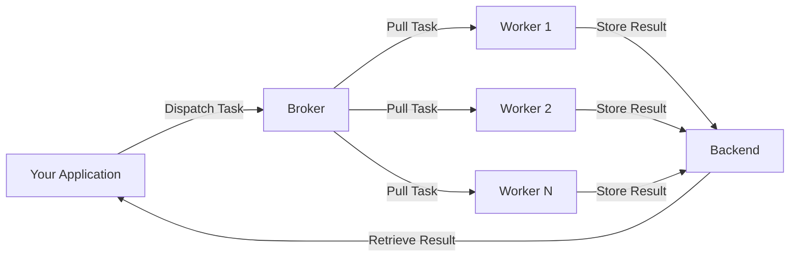

# Getting Started with Chicory

Welcome to Chicory! This section will help you get up and running quickly.

## What is Chicory?

Chicory is a **lightweight, async-native job queue** for Python. It allows you to:

- **Execute tasks asynchronously** in the background
- **Distribute work** across multiple worker processes or machines
- **Retry failed tasks** automatically with smart backoff strategies
- **Monitor task progress** and retrieve results
- **Scale horizontally** by adding more workers

## Who is Chicory for?

Chicory is perfect for you if:

- You're building a **modern async Python application** (using FastAPI, Starlette, aiohttp, etc.)
- You need to **offload long-running tasks** to background workers
- You want **type-safe task definitions** with automatic validation
- You prefer a **simple, clean API** over complex configuration
- You're looking for a **Celery alternative** that's built for async from the ground up

## Core Concepts

Before diving in, let's understand the key concepts:

### Tasks

A **task** is a Python function decorated with `@app.task()`. Tasks can be executed asynchronously by workers:

```python
@app.task()
async def send_email(to: str, subject: str) -> dict:
    # This runs in a worker process
    ...
```

### Broker

The **broker** is a message queue that holds tasks waiting to be executed. Chicory supports:

- **Redis** - Fast, simple, great for getting started
- **RabbitMQ** - Enterprise-grade, advanced routing features

### Backend

The **backend** (optional) stores task results. Supported backends:

- **Redis** - Fast, simple
- **PostgreSQL** - Relational database with SQL queries
- **MySQL** - Popular relational database
- **SQLite** - Lightweight, no server needed
- **MS SQL Server** - Enterprise Microsoft database

### Workers

**Workers** are processes that:

1. Connect to the broker
2. Pull tasks from the queue
3. Execute the task function
4. Store results in the backend (if configured)

You can run multiple workers to process tasks in parallel.

## Architecture Overview

Here's how the pieces fit together:



## Quick Navigation

Ready to get started? Check out these guides:

<div class="grid cards" markdown>

-   :material-clock-fast:{ .lg .middle } __Quick Start__

    ---

    Get Chicory installed and running in under 5 minutes

    [:octicons-arrow-right-24: Quick Start](quick-start.md)

-   :material-download:{ .lg .middle } __Installation__

    ---

    Detailed installation instructions for all extras

    [:octicons-arrow-right-24: Installation](installation.md)

-   :material-school:{ .lg .middle } __Tutorial__

    ---

    In-depth tutorial covering all features

    [:octicons-arrow-right-24: Tutorial](../tutorial/index.md)

</div>

## Need Help?

- Check the [User Guide](../user-guide/index.md) for detailed documentation
- Browse [Examples](../examples/index.md) for real-world code
- Visit our [GitHub Issues](https://github.com/chicory-dev/chicory/issues) for support

Let's get started!
